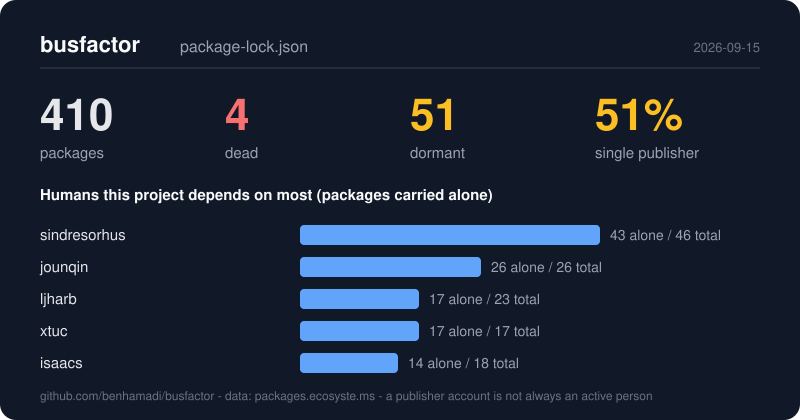

# busfactor

**Which humans does your project actually depend on?**

`busfactor` reads your lockfile and tells you which dependencies are dead or
dormant, which ones a single account can publish, which named people are
carrying the most of them alone (with a sponsor link when there is one), and
which packages already have a maintained successor.

```text
$ npx @genamed/busfactor

busfactor - 410 packages in package-lock.json

Dead (deprecated or archived)                 4
Dormant (>3y no release, >1y no commit)       51
Single publisher account                      213  (51%)  of which org-owned? 14
With a security advisory                      49
With a funding link                           310
Distinct publisher accounts                   223

The humans this project depends on most (packages carried alone)
  sindresorhus              43 alone /  46 total  https://github.com/sponsors/sindresorhus
  jounqin                   26 alone /  26 total  https://github.com/sponsors/JounQin
  ljharb                    17 alone /  23 total  https://github.com/sponsors/ljharb
  xtuc                      17 alone /  17 total
  isaacs                    14 alone /  18 total  https://github.com/sponsors/isaacs
  ...
```

That is a plain app with eight direct dependencies (axios, express, jest,
lodash, moment, react, react-dom, webpack). 410 packages, 51% of them
publishable by exactly one account, and one person carries 43 of them alone.
The full run is in [`examples/sample-output.md`](examples/sample-output.md).



## Two things in this repository

1. **The successor map** - [`data/successors.json`](data/successors.json).
   A small, sourced list of packages that are no longer maintained, each with
   a pointer to what to use instead. This is the durable asset: it is meant
   to be read by other tools, not just by this CLI. See
   [Using the successor map](#using-the-successor-map).
2. **The CLI** - `npx @genamed/busfactor`. Zero runtime dependencies, Node 20+.

## Install and use

```sh
npx @genamed/busfactor                      # scan the lockfile in the current folder
npx @genamed/busfactor path/to/project      # or a folder, or a lockfile path
npx @genamed/busfactor --md                 # markdown card for a README or a PR
npx @genamed/busfactor --svg --out card.svg # 800x420 shareable card
npx @genamed/busfactor --json               # everything, machine-readable
npx @genamed/busfactor --offline            # cache only, no network
npx @genamed/busfactor --fail-on dead       # exit 1 if any dependency is dead (CI)
npx @genamed/busfactor --fail-on solo-critical  # exit 1 if a dead/dormant package has one publisher
```

Or install it: `npm install -g @genamed/busfactor`.

Supported lockfiles in v0:

| File | Ecosystem | What v0 does |
|---|---|---|
| `package-lock.json` (v2, v3) | npm | full analysis |
| `requirements.txt`, `poetry.lock` | PyPI | basic analysis (maintainer data from ecosyste.ms) |
| `uv.lock`, `Cargo.lock`, `go.sum` | PyPI, crates.io, Go | names only: successor suggestions, "not yet analysed" |

### What the flags mean

- **dead**: the registry marks the package deprecated, or its source repository is archived.
- **dormant**: no release for more than 3 years *and* no commit for more than 1 year (or no repository at all).
- **single publisher**: exactly one account can publish a new version. `org-owned?` is a guess that the account is an organisation (for example `types` for `@types/*`), not a person.
- **solo-critical** (`--fail-on`): a single-publisher package that is also dead or dormant.
- **humans**: publisher accounts, ranked by how many packages they carry alone. The funding link is the one found on their packages that mentions their login, or one shared by several of their packages.

Data comes from [packages.ecosyste.ms](https://packages.ecosyste.ms) (one request per package, 4 in parallel, cached for 7 days in `~/.cache/busfactor`) plus, for npm, the registry's `deprecated` and `funding` fields.

## What it does NOT do

- **No vulnerability scanning.** It shows an advisory *count* so you know where to look, nothing more. Use [osv-scanner](https://github.com/google/osv-scanner).
- **No licence checks.**
- **No repository health score.** [OpenSSF Scorecard](https://github.com/ossf/scorecard) does that per repository.
- **No package-size or performance advice.** For npm, [e18e/module-replacements](https://github.com/e18e/module-replacements) already maintains a much larger list of replacements, including "native" and "smaller" ones. Our npm entries focus on *abandonment* only (deprecated, archived, sabotaged). We defer to e18e for the rest and aim to collaborate rather than duplicate.
- **No malware, typosquat or install-script analysis.** See uzomuzo and your registry's own tooling.

## Using the successor map

The map is plain JSON validated against [`data/schema.json`](data/schema.json).
Every entry has at least one source URL, and CI re-checks weekly that every
package and successor still exists on its registry.

```json
{
  "ecosystem": "cargo",
  "package": "atty",
  "status": "unmaintained",
  "successor": "std::io::IsTerminal",
  "successor_kind": "stdlib",
  "since": "2024-09",
  "sources": ["https://rustsec.org/advisories/RUSTSEC-2024-0375.html"],
  "notes": "..."
}
```

Ways to consume it:

- **Raw URL**: `https://raw.githubusercontent.com/GenAmed/busfactor/main/data/successors.json`
- **npm subpath export** (no CLI involved):
  ```js
  import successors from "@genamed/busfactor/successors" with { type: "json" };
  const dead = successors.entries.filter((e) => e.ecosystem === "npm");
  ```
- **Library**: `import { scan, matchSuccessors } from "busfactor"`.

Statuses: `archived`, `deprecated`, `unmaintained`, `abandoned`, `sabotaged`.
Successor kinds: `fork` (same code continued), `rewrite` (same job, similar API),
`stdlib` (the language covers it now), `different-api` (you will change code).
`successor` is `null` when there is no single drop-in replacement; the `notes`
then say what to do.

## GitHub Action

```yaml
- uses: GenAmed/busfactor@main
  with:
    path: .            # folder or lockfile
    fail-on: ""        # "", "dead" or "solo-critical"
```

The markdown card lands in the job summary. To also post it as a PR comment,
add a step with `actions/github-script` that reads the `markdown-file` output:

```yaml
- uses: GenAmed/busfactor@main
  id: busfactor
- uses: actions/github-script@v7
  if: github.event_name == 'pull_request'
  with:
    script: |
      const body = require("fs").readFileSync("${{ steps.busfactor.outputs.markdown-file }}", "utf8");
      await github.rest.issues.createComment({ ...context.repo, issue_number: context.issue.number, body });
```

The job needs `pull-requests: write` permission for the comment.

## Caveats

- **A publisher account is not an active person.** "One account" can hide a team behind a shared login, a bot, or an organisation; "several accounts" can be one person plus long-gone co-maintainers. Treat the numbers as a prompt to go look, not as a verdict.
- **ecosyste.ms data freshness.** Maintainer lists, repository state and release dates are synced periodically, not live. A package deprecated yesterday may show as fine for a while; a maintainer removed last month may still be listed.
- **The 7-day cache** means a second run in the same week shows the same picture. Delete `~/.cache/busfactor` to refresh.
- **Dependent-repository counts** come from ecosyste.ms and are approximate; they are only used for ordering.
- **PyPI, crates.io and Go** analysis is minimal in v0 (see the table above).

## Roadmap

- Full analysis for Cargo.lock, go.sum, uv.lock, Gemfile.lock, composer.lock.
- pnpm-lock.yaml and yarn.lock.
- "Who else could publish?" - detect packages whose only publisher has been silent everywhere for a year.
- A direct-vs-transitive split, so you know which of the flagged packages you chose yourself.
- Export the successor map to the OSV/`module-replacements` formats to feed other tools.
- Compare two scans (`--diff`) to see what changed since last month.

## Contributing and governance

One pull request = one sourced entry. See [CONTRIBUTING.md](CONTRIBUTING.md)
and [GOVERNANCE.md](GOVERNANCE.md). MIT licence.
